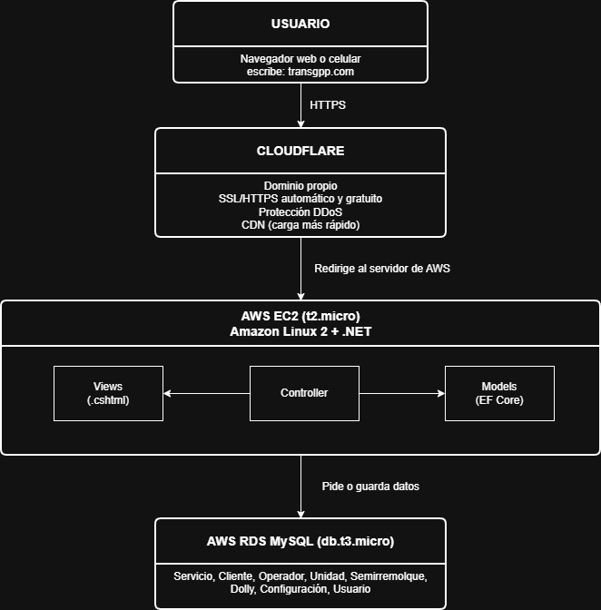

# ADR-01: [Título corto de la decisión]

| Campo  | Valor |
|--------|-------|
| Autor  | Michelle Cámara |
| Fecha  | 15/05/2026 |
| Estado | `Propuesto` |

---

## Contexto

**TransGGP** es un sistema web de gestión de servicios de transporte de carga desarrollado para un emprendimiento familiar que opera un tráiler. Axctualmente, el negocio registra
todos sus viajes en un archivo *Excel* con macros, lo que genera tres principales problemas: solo una persona puede usarlo a la vez, no es accesible desde dispositivos móviles y existe riesgo de pérdidas de información si el archivo se corrompe o se modifica accidentalmente.

El objetivo del sistema es digitalizar ese proceso en una página con formularios de captura, tabla de historial de servicios y dashboards visuales generados automáticamente con
los datos acumulados. Esto permitirá que cualquier miembro de la familia pueda registrar y consultar los viajes desde cualquier dispositivo, además de reducir el riesgo de pérdida de datos y mejorar la organización de la información.
Los usuarios principales serán dos, por el momento, en donde un administrador con acceso completo a reportes y catálogos, y un capturista que 
registra los servicios del día a día. Ambos deben poder acceder desde cualquier dispositivo con Internet.

Las restricciones del proyecto son variables: tiempo de desarrollo, desarrollarlo en .NET, conocimiento previo de base de datos, presupuesto de infraestructura, y necesidad de que el sistema funcione
en producción real desde el día de la entrega.

---

## Decisión

Se utilizará el patrón arquitectónico **MVC** *(Model-View-Controller)*, implementado con *ASP.NET Core MVC)* conectado a una base de datos MySQL alojada en Amazon RDS, desplegando una instancia en EC2 AWS, y con el dominio y capa de seguridad gestionados a través de Cloudflare. El ORM utilizado será *Entity Framework Core* con el conector *Pomelo* para MySQL.

## ¿Por qué?

MVC es el patrón más adecuado para este proyecto, ya que TranspGG tiene una estructura
clara de formularios de entrada, tablas de consulta, y dashboards de visualización, que se mapea directamente al flujo Controller --> Model --> View de MVC. Cada pestaña de aplicación corresponde a un Controller con sus acciones y vistas asociadas, lo que hace que la organización sea intuitiva y fácil de mantener. Además, ASP.NET Core MVC es un framework maduro y bien soportado que se integra perfectamente con Entity Framework Core para la gestión de datos, lo que facilita el desarrollo rápido y eficiente del sistema. 

Además, ASP.NET Core MVC tiene una gran cantidad de documentación, tutoriales y recursos disponibles para que un principiante desarrolle en .NET, lo que reduce
la curva de aprendizaje y el riesgo de bloqueos técnicos durante el desarrollo.

Por último, la elección de MySQL como base de datos sobre SQL Server responde al conocimiento previo en MariaDB -ambos comparten sintaxis y comportamiento-, y a una diferencia de costo significativa en AWS RDS: MySQL que cuesta aproximadamente $15/mes frente a los $30-50/mes de SQL Server.

Cloudflare se incorporará como capa de entrada porque el dominio ya fue adquirido en esta plataforma por la empresa. Ofrece SSL/HTTPS automático y gratuito, protección contra ataques, CDN sin costo adicional apuntando al servidor EC2 donde corre la aplicación.

### Alternativas consideradas

| Alternativa | Por qué la descarté |
|-------------|---------------------|
| **Blazor Server con MVVM** | Aunque MVVM es el patrón natural para Blazor, lo descarté porque tiene menos recursos de aprendizaje para principiantes y mayor complejidad. |
| **API REST + Frontend en JavaScript** | Se descartó porque requiere aprender dos tecnologías simultáneamente lo que excede la capacidad de desarrollo en el tiempo disponible |
| **MVP (Model-View-Presenter)** | No tiene soporte nativo en frameworks web de .NET. Fue diseñado para aplicaciones de escritorio como WinForms, por lo que implementarlo en web requeriría mucho código manual sin ventajas claras sobre MVC. |
| **Arquitectura Hexagonal** | Permite una separación total entre lógica de negocio e infraestructura, pero es demasiado compleja para un proyecto con una desarrolladora principiante. Se considera una evolución futura cuando el sistema crezca. |
| **SQL Server en RDS** | Compatible con .NET, pero el costo mínimo (~$30–50/mes) es el doble que MySQL sin ventajas funcionales relevantes para este proyecto. Pomelo permite usar Entity Framework Core con MySQL de forma idéntica. |
| **Cloudflare como servidor de la aplicación** | Cloudflare no soporta ejecución de aplicaciones .NET. Sus servicios Pages y Workers están diseñados para sitios estáticos y funciones en JavaScript. Se usa únicamente como capa de dominio, DNS y seguridad apuntando al EC2. |

---

## Consecuencias

**✅ Lo que gano:**

- **Técnica**: La separación clara de responsabilidades entre Controllers, Models, y Views hace que cada módulo del sistema sea independiente. Agregar una nueva funcionalidad como exportación a PDF o reportes adicionales no requiere modificar el sistema, lo que facilita el mantenimiento futuro.
- **Proceso**: MVC permite avanzar módulo por módulo de forma ordenada. Se puede tener el CRUD de Servicios funcionando en la semana 2 sin que el Dashboard esté listo, lo que hace posible entregar avances.
- **Negocio**: Al ser un patrón ampliamente utilizado, es fácil encontrar desarrolladores con experiencia en MVC para futuras contrataciones o colaboraciones. Además, la integración con Entity Framework Core facilita la gestión de datos y reduce el riesgo de errores en consultas SQL manuales.

**⚠️ Lo que sacrifico o asumo:**

- **Técnica**: MVC realiza una recarga completa de página cada que realiza una acción el usuario, a diferencia de Blazor o frameworks de JS. Para los dashboards con gráficas, esto se compensa cargando los datos de forma asíncrona con Chart.js pero la experiencia no será tan fluida como con una Single Page Application.
- **Deuda o Riesgo**: Si en el futuro, el negocio crece y requiere una aplicación móvil, o una API para integrarse en otros sistemas como facturación o GPS, la arquitectura MVC actual tendría que refactorizarse hacia una API REST separada. 
## Diagrama

Un boceto de cómo se estructura tu sistema (draw.io, Mermaid o a mano escaneado)

