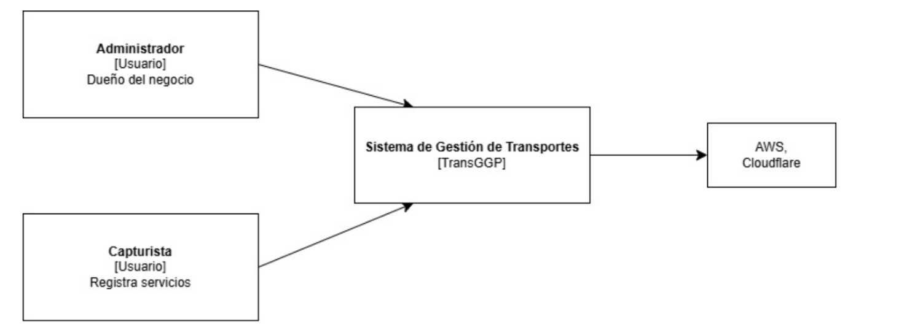
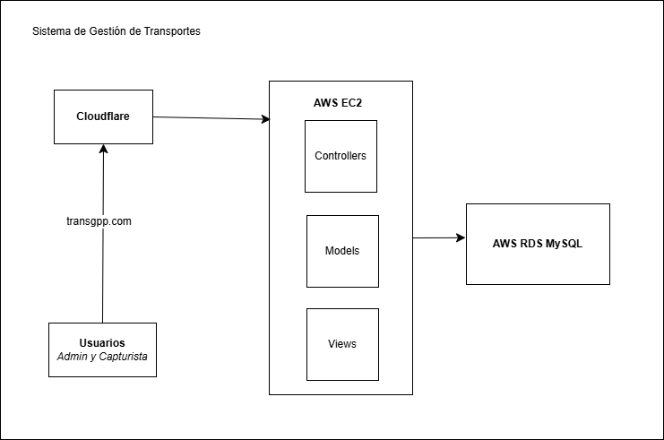
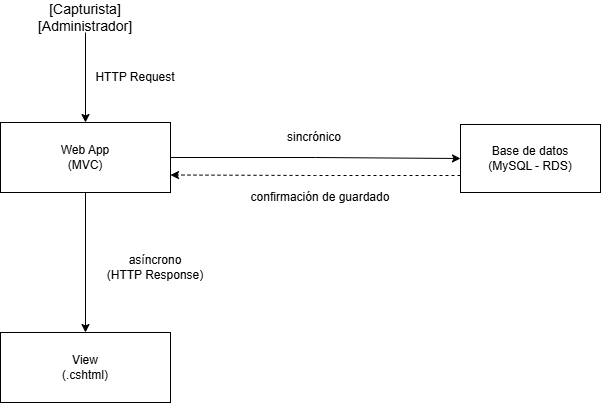

# ADR-02: Vistas arquitectónicas y diagramas

| Campo  | Valor |
|--------|-------|
| Autor  | Michelle Cámara |
| Fecha  | DD/MM/AAAA |
| Estado | `Propuesto` 

---

## Contexto

**TransporteGGP** es un sistema web de gestión de servicios de transporte de carga desarrollado para un emprendimiento familiar que opera un tráiler. Axctualmente, el negocio registra
todos sus viajes en un archivo *Excel* con macros, lo que genera tres principales problemas: solo una persona puede usarlo a la vez, no es accesible desde dispositivos móviles y existe riesgo de pérdidas de información si el archivo se corrompe o se modifica accidentalmente.

El objetivo del sistema es digitalizar ese proceso en una página con formularios de captura, tabla de historial de servicios y dashboards visuales generados automáticamente con
los datos acumulados. Esto permitirá que cualquier miembro de la familia pueda registrar y consultar los viajes desde cualquier dispositivo, además de reducir el riesgo de pérdida de datos y mejorar la organización de la información.
Los usuarios principales serán dos, por el momento, en donde un administrador con acceso completo a reportes y catálogos, y un capturista que 
registra los servicios del día a día. Ambos deben poder acceder desde cualquier dispositivo con Internet.

Las restricciones del proyecto son variables: tiempo de desarrollo, desarrollarlo en .NET, conocimiento previo de base de datos, presupuesto de infraestructura, y necesidad de que el sistema funcione
en producción real desde el día de la entrega.


---

## Decisiónc

Se documentará la arquitectura de TransporteGGP utilizando **cuatro vistas arquitectónicas**: *Vista Lógica*, *Vista de Desarrollo*, *Vista de Procesos*, y *Vista de Despliegue*. Los diagramas se realizarán en formato **Draw.io** para garantizar una mejor claridad y organización. Además de ser visualmente agradable para el entendimiento de las vistas.
### ¿Por qué?

Cada vista responde una pregunta sobre el sistema: 

La *vista lógica* responde: *¿qué modelos funcionales tiene el sistema y cuales son sus responsabilidades?* Le sirve al dueño del negocio para verificar que el sistema cubre todo lo que necesita: gestión de servicios, clientes, operadores, equipo, acceso de por roles, dashboards y reportes. 
La *vista de desarrollo* responde: *¿cómo está organizado el código?* Le sirve a cualquier desarrollador que desee entender el funcionamiento del proyecto, para que pueda identificar rápidamente dónde se encuentra cada módulo, cómo se relacionan entre sí, y cómo agregar nuevas funcionalidades sin romper lo existente.
La *vista de procesos* responde: *¿qué ocurre en el tiempo de ejecución cuando un usuario realiza una acción?* Le sirve al arquitecto para entender el flujo del sistema como los datos que el capturista llen, y los datos que quedan guardados en la base de datos.
La *vista de despliegue* responde: *¿dónde vive físicamente el sistema y qué infraestructura necesita?* Le sirve al administrador de sistemas para saber qué configurar, en este caso, Cloudflare para el dominio, EC2 para el servidor, y RDS para la base de datos.

### Alternativas consideradas

| Alternativa | Por qué la descarté |
|-------------|---------------------|
| **Solo el diagrama C4 Nivel 1 y Nivel 2** | El C4 cubre el contexto y los contenedores pero no muestra los módulos funcionales del dominio ni el flujo de procesos en tiempo de ejecución. No es suficiente para documentar las cuatro perspectivas. |
| **Draw.io para todos los diagramas** | Genera archivos binarios XML que son difíciles de versionar en Git. Un cambio pequeño en el diagrama genera diferencias ilegibles en el historial de commits, lo que no refleja proceso real de desarrollo. |
| **Una sola vista unificada** | Un solo diagrama no puede responderle a todas las audiencias al mismo tiempo. El dueño del negocio, el desarrollador y el administrador de sistemas tienen preguntas completamente distintas sobre el mismo sistema. |
| **Excalidraw o PowerPoint** | Son herramientas visuales que no se integran con el repositorio de Git. Los diagramas quedan como archivos separados del código y se dessincronizan fácilmente cuando la arquitectura cambia. |
 

---

## Consecuencias

**✅ Lo que gano:**

**Técnica**: Cada vista cubre un ángulo distinto del sistema sin repetir información. La vista lógica  verifica que el dominio está completo. La Vista de Desarrollo documenta la estructura del código para facilitar el mantenimiento. La Vista de Procesos expone el flujo crítico de registro de servicios. La Vista de Despliegue documenta la infraestructura cloud para el despliegue futuro en producción. 

**Proceso**: Al usar Draw.io, los diagramas son visualmente claros y agradables para el entendimiento de las vistas. Además, al tener cada vista en un archivo separado, se pueden versionar de forma independiente en Git, lo que refleja el proceso real de desarrollo y evolución de la arquitectura a lo largo del tiempo.

**⚠️ Lo que sacrifico o asumo:**

**Limitación técnica**:Al usar Draw.io, los diagramas son archivos binarios XML que no se pueden versionar de forma legible en Git. Esto significa que no se puede rastrear fácilmente la evolución de los diagramas a lo largo del tiempo, lo que dificulta el proceso de revisión y colaboración en equipo. Sin embargo, se asume que la claridad visual y la organización de los diagramas compensan esta limitación.

**Deuda o riesgo**: Si la arquitectura ambia significativamente en las siguientes fases, por ejemplo al agregar Repository Pattern o separar en API REST, los cuatro diagramas deberán actualizarse manualmente para mantenerse sincronizados con el código real. Es una deuda de documentación asumida conscientemente.
## Diagrama

### Nivel 1 - Vista Lógica

Muestra los módulos funcionales del sistema y sus responsabilidades. Responde: **¿qué hace el sistema y cómo está organizado funcionalmente?**



### Nivel 2 - Vista de Despliegue

Muestra la infraestructura cloud donde vive el sistema. Responde: **¿dónde vive físicamente el sistema y qué infraestructura necesita?**



### Nivel 3 - Vista de Desarrollo

Muestra el flujo de procesos. En este caso, se encuentra la estructura de carpetas del código.

```text
TransGGP.sln
└── TransGGP/
    ├── Controllers/
    │   ├── ServiciosController.cs
    │   ├── ClientesController.cs
    │   ├── OperadoresController.cs
    │   └── DashboardController.cs
    ├── Models/
    │   ├── Servicio.cs
    │   ├── Cliente.cs
    │   ├── Operador.cs
    │   ├── Unidad.cs
    │   ├── Semirremolque.cs
    │   ├── Dolly.cs
    │   ├── Configuracion.cs
    │   └── Usuario.cs
    ├── Views/
    │   ├── Servicios/
    │   ├── Clientes/
    │   ├── Operadores/
    │   └── Dashboard/
    └── Data/
        └── ApplicationDbContext.cs
   ```

   ### Vista de Procesos

   Muestra el flujo de procesos en tiempo de ejecución. En este caso, se muestra el proceso de registro de un nuevo servicio desde el formulario de captura hasta la base de datos.

   


   ## Clausula de IA

   Se utilizó herramientas de inteligencia artificial para autocompletados de texto, correción gramátical y para generar la organización actual de mi proyecto en el ADR. 
   Se utilizó las diapositivas del profesor para entender las vistas arquitectónicas, y los diagramas de ejemplo para entender la visualización de cada una, y así generar los diagramas en Draw.io.