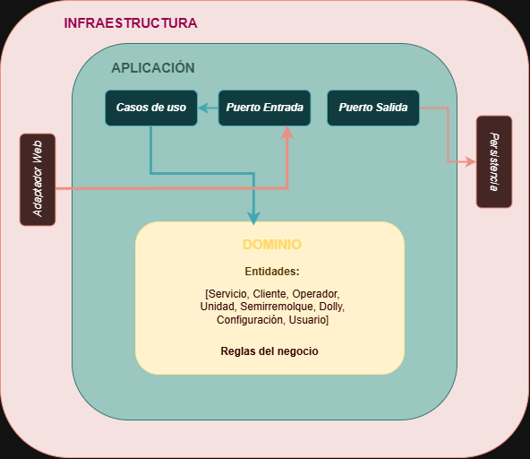

# ADR-01: Arquitectura seleccionada

| Campo  | Valor |
|--------|-------|
| Autor  | Michelle Cámara |
| Fecha  | 12/06/2026 |
| Estado | `Propuesto` |

---

## Contexto

**TransGGP** es un sistema web de gestión de servicios de transporte de carga desarrollado para un emprendimiento familiar que opera un tráiler. Axctualmente, el negocio registra
todos sus viajes en un archivo *Excel* con macros, lo que genera tres principales problemas: solo una persona puede usarlo a la vez, no es accesible desde dispositivos móviles y existe riesgo de pérdidas de información si el archivo se corrompe o se modifica accidentalmente.

En el ADR-01 y ADR-02 se implementó el patrón MVC con ASP.NET Core. Esa desición fue adecuada para arrancar el desarrollo y construir la base del sistema. Sin embargo, conforme el proyecto y las clases avanzaron se identificó la necesidad de cambiar el patrón para mejorar la organización del código y facilitar el mantenimiento futuro.

Con MVC, la lógica tiende a quedar acoplada al framework web y a Entity Framework , lo que dificulta el mantenimiento futuro y la escalabilidad del sistema. Además, con MVC se tiene mucho código repetido entre controladores, 
lo que hace que sea difícil de organizar y mantener. Por lo que, la arquitectura hexagonal surge como una solución para mejorar la organización del código y facilitar el mantenimiento futuro.

Esta decisión desplaza las decisiones tomadas en los anteriores de ADR-01 y ADR-02.

---

## Decisión

Se adopta la **Arquitectura Hexagonal**, también conocida como **Ports** and **Adapters**. 

La arquitectura se organiza en tres capas: 
* El **dominio**, que contiene las entidades del negocio y las reglas puras, sin ninguna dependencia de frameworks externos.
* La capa de **Aplicación** contiene los casos de uso del sistema y define los **puertos**, que son interfaces que el dominio necesita para comunicarse con el exterior.
* La capa de **Infraestructura** contiene los **adaptadores** que son las implementaciones concretas de los puertos: el adaptador web (ASP.NET Core MVC), el adaptador de base de datos (Entity Framework Core con MySQL), y futuros adaptadores como una API REST o notificaciones.

## ¿Por qué?

La característica concreta de la arquitectura hexagonal que resuelve el problema de TransporteGGP es el **desacoplamiento** entre la lógica y los detalles técnicos mediante puertos y adaptadores. 

En la práctica esto se traduce en que el dominio (Service, Customer, Operator, etc.) no sabe nada de ASP.NET Core ni de Entity Framework Core. Solo conoce sus propias reglas de negocio y los puertos que definen sus necesidades. Los adaptadores de infraestructura implementan esos puertos y quedan completamente aislados del dominio. 

Para el contexto del proyecto, esto significa una ventaja porque la capa de aplicación podría tener una interfaz para el almacenamiento en MySQL o en PostgreSQL, lo que permitiría cambiar de base de datos en el futuro sin afectar la lógica de negocio.

Esta es exactamente la razón por la que se cambio de MVC a Arquitectura Hexagonal, porque el objetivo del proyecto es que el sistema escale y se adapte a las necesidades del negocio.


### Alternativas consideradas

### Alternativas consideradas

| Alternativa | Por qué la descarté |
|-------------|---------------------|
| **MVC tradicional (ADR-01)** | Aunque permitió arrancar rápido, acopla la lógica de negocio al framework web y a Entity Framework. Agregar una app móvil o cambiar de base de datos en el futuro requeriría modificar el código central, lo que va en contra de la visión de crecimiento del negocio. |
| **Arquitectura por capas (N-Tier)** | Separa el sistema en capas de presentación, lógica y datos, pero las dependencias fluyen en una sola dirección hacia abajo. La lógica de negocio sigue dependiendo de la capa de datos, mientras que en hexagonal el dominio no depende de nada externo, lo que da mayor flexibilidad para agregar adaptadores. |
| **Microservicios** | Divide el sistema en servicios independientes desplegables por separado. Es excesivo para un negocio con dos usuarios y un tráiler. Agrega complejidad de despliegue, comunicación en red y monitoreo que no se justifica para el alcance actual ni el de mediano plazo. |
| **Event-Driven (orientada a eventos)** | Útil cuando hay muchos componentes que reaccionan a eventos en tiempo real. Para un sistema de registro y consulta de servicios con bajo volumen, agrega complejidad innecesaria de colas de mensajes y procesamiento asíncrono que el negocio no requiere. |

---

## Consecuencias

**✅ Lo que gano:**

- **Técnica**: La lógica de negocio queda completamente aislada de los detalles técnicos. Puedo agregar nuevas formas de acceder al sistema (app móvil, API REST, integración con facturación) creando solo un adaptador nuevo, sin tocar el núcleo. También puedo cambiar de base de datos reemplazando únicamente el adaptador de persistencia. Esto cumple directamente con la visión de crecimiento del negocio.

- **Proceso**: El núcleo del dominio se puede probar de forma aislada con pruebas unitarias, sin necesidad de levantar la base de datos ni el servidor web, porque no depende de ellos. Esto hace el desarrollo más confiable y permite verificar las reglas de negocio de forma independiente.

- **Negocio**: La lógica de negocio está separada del framework, lo que permite que el sistema evolucione con el tiempo sin acoplamientos. Esto es clave para un negocio que busca crecimiento y escalabilidad.

**⚠️ Lo que sacrifico:**

- **Técnica**: La arquitectura hexagonal introduce una capa adicional de abstracción que puede ser confusa para desarrolladores no familiarizados con el patrón, lo que requiere una curva de aprendizaje más pronunciada. Adicionalmente, la complejidad de los puertos y adaptadores puede aumentar el tiempo de desarrollo y dificultar el mantenimiento futuro.

- **Deuda o Riesgo**: Siendo desarrolladora principiante, he decidido tomar esta decisión para poder aprender y entender mejor los conceptos de la arquitectura hexagonal. Sin embargo, corro el riesgo de que el proyecto no sea lo suficientemente escalable para el crecimiento del negocio, lo que requeriría una refactorización en el futuro.
  
## Diagrama Hexagonal


## Estructura de carpetas

```csharp
    TransGGP.sln
    ├── TransGGP.Domain/              ← Núcleo, sin dependencias
    │   ├── Entities/
    │   │   ├── Servicio.cs
    │   │   ├── Cliente.cs
    │   │   ├── Operador.cs
    │   │   ├── Unidad.cs
    │   │   ├── Semirremolque.cs
    │   │   ├── Dolly.cs
    │   │   ├── Configuracion.cs
    │   │   └── Usuario.cs
    │   └── (reglas de negocio puras)
    │
    ├── TransGGP.Application/         ← Casos de uso y puertos
    │   ├── UseCases/
    │   │   ├── RegistrarServicio.cs
    │   │   ├── ConsultarServicios.cs
    │   │   └── GenerarDashboard.cs
    │   └── Ports/
    │       ├── IServicioRepository.cs    (puerto de salida)
    │       └── IServicioService.cs       (puerto de entrada)
    │
    ├── TransGGP.Infrastructure/      ← Adaptadores
    │   ├── Persistence/
    │   │   ├── ApplicationDbContext.cs   (EF Core + Pomelo)
    │   │   └── ServicioRepository.cs     (implementa IServicioRepository)
    │   └── (futuros adaptadores)
    │
    └── TransGGP.Web/                 ← Adaptador de entrada web
        ├── Controllers/
        │   ├── ServiciosController.cs
        │   ├── ClientesController.cs
        │   └── DashboardController.cs
        └── Views/
```

## Clausula de IA

Se utilizó IA para generar la estructura de carpetas y así poder tener una mejor visión de como se vería el proyecto. Todo lo demás, se realizó con la presentación del profesor.