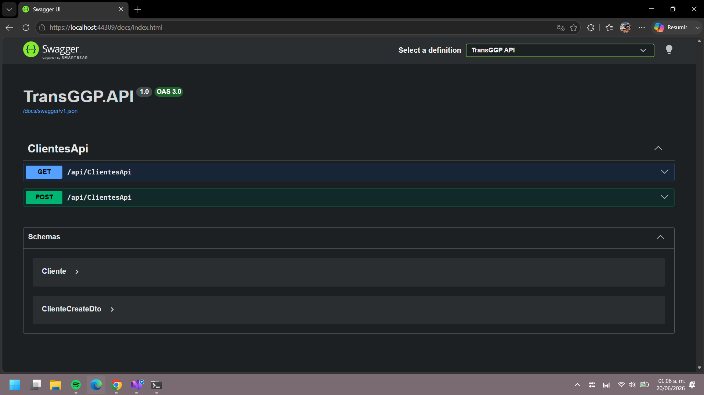
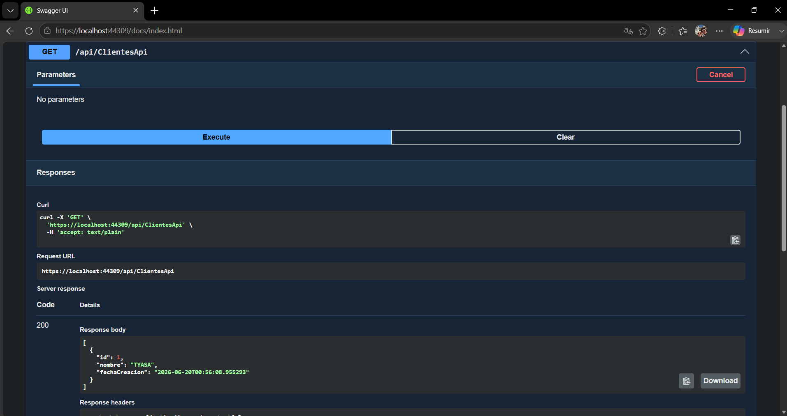
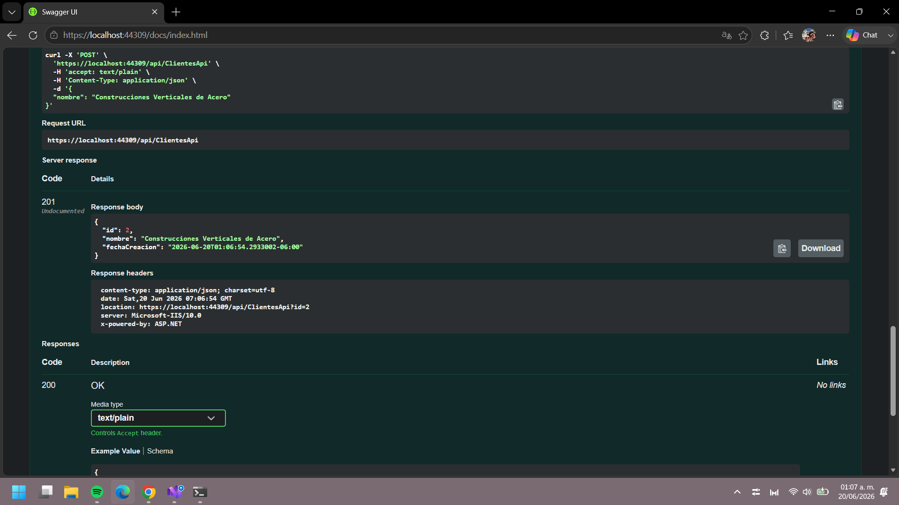

# ADR-03: Incorporación de una API REST con ASP.NET Core Web API


| Campo  | Valor |
|--------|-------|
| Autor  | Michelle Cámara González |
| Fecha  | 20/06/2026 |
| Estado | `Propuesto` |

---

## Contexto

TransGGP es un sistema web de gestión de servicios de transporte de carga para Transportes GGP. En el ADR-03 se adoptó la arquitectura hexagonal (Ports and Adapters), que permite agregar nuevas formas de acceder al sistema sin modificar la lógica de negocio central.

Se identifica la necesidad de exponer funcionalidades del sistema a través de una **API REST**, que permita:
- Que clientes externos (futuras aplicaciones móviles, sistemas de terceros) accedan a los datos
- Que el operador de campo pueda consultar información desde cualquier cliente HTTP
- Que el sistema sea escalable y preparado para integraciones futuras

Como primer paso, se implementan dos endpoints iniciales sobre el recurso `Cliente`:
- **GET /api/clientes** — Listar todos los clientes del sistema
- **POST /api/clientes** — Registrar un nuevo cliente

La API se documenta con **Swagger (OpenAPI)**, que es el estándar de la industria y permite probar los endpoints interactivamente sin herramientas externas.

Las restricciones que influyeron en esta decisión son: tiempo de desarrollo de tres meses, desarrolladora principiante, la arquitectura hexagonal ya adoptada (que facilita agregar este nuevo adaptador), y el requerimiento académico de que la API tenga documentación mediante Swagger.

---

## Decisión

Se implementa una **API REST** usando **ASP.NET Core Web API** con **Swagger (OpenAPI)** como documentación interactiva.

La API se estructura como un **nuevo adaptador de entrada** dentro de la arquitectura hexagonal (proyecto `TransGGP.API`), conectándose a los mismos casos de uso y servicios que ya utiliza la interfaz web MVC.

### Endpoints implementados (MVP — Minimum Viable Product)

| Método | Endpoint | Descripción | Respuesta exitosa |
|--------|----------|-------------|-------------------|
| `GET` | `/api/clientes` | Obtiene la lista de todos los clientes | 200 OK — Lista JSON |
| `POST` | `/api/clientes` | Registra un nuevo cliente en el sistema | 201 Created — Cliente creado |

**Estructura del POST:**

Solicitud:
```json
{
  "nombre": "Construcciones Verticales de Acero"
}
```

Respuesta (201 Created):
```json
{
  "id": 1,
  "nombre": "Construcciones Verticales de Acero",
  "fechaCreacion": "2026-06-20T10:30:45.1234567"
}
```

### ¿Por qué REST?

REST es el estilo arquitectónico de APIs más utilizado y mejor soportado. La característica concreta que resuelve el problema de TransGGP es que REST usa los métodos HTTP estándar (GET, POST, PUT, DELETE) sobre recursos identificados por URLs (ej: `/api/clientes`), lo que lo hace universalmente compatible con cualquier cliente: navegadores, aplicaciones móviles, otros sistemas backend o herramientas de prueba como Postman.

Swagger se elige para documentar la API porque:
- **Estándar de la industria** — lo usa la mayoría de empresas modernas
- **Documentación interactiva** — se genera automáticamente del código
- **Sin herramientas externas** — permite probar los endpoints directamente desde el navegador

### Alternativas consideradas

| Alternativa | Por qué la descarté |
|-------------|---------------------|
| **GraphQL** | Permite al cliente pedir exactamente los datos que necesita. Es potente pero agrega complejidad de aprendizaje que no se justifica para un MVP con operaciones CRUD simples en un sistema con bajo volumen de datos. Se puede evaluar en versiones futuras si el volumen crece. |
| **gRPC** | Ofrece comunicación de alto rendimiento mediante Protocol Buffers. Está orientado a comunicación entre microservicios internos, no es tan compatible con navegadores ni es fácil de consumir desde una app móvil sencilla. |
| **SOAP** | Protocolo basado en XML, más antiguo y verboso. La industria se ha movido hacia REST para APIs web modernas. Usarlo sería ir contra la corriente sin beneficio. |
| **Mantener solo web (sin API)** | Impediría conectar clientes externos como apps móviles o sistemas de terceros, contradiciendo la visión de crecimiento del negocio y desaprovechando la flexibilidad de la arquitectura hexagonal. |

---

## Consecuencias

**✅ Lo que gano:**

- **Técnica:** El sistema queda preparado para ser consumido por cualquier cliente externo (app móvil futura, sistemas de terceros). Al implementar la API como un nuevo adaptador de entrada en la arquitectura hexagonal, reutilizo los servicios y casos de uso existentes sin duplicar lógica de negocio, demostrando el valor de la arquitectura adoptada en ADR-03.

- **Proceso o equipo:** Swagger genera documentación interactiva siempre actualizada y permite probar los endpoints directamente desde el navegador durante desarrollo, sin necesidad de herramientas como Postman o Insomnia. Esto acelera tanto el desarrollo como las pruebas manuales.

**⚠️ Lo que sacrifico o asumo:**

- **Limitación técnica:** El MVP actual (GET y POST para clientes) es muy básico. Faltan endpoints para otros recursos (servicios, operadores, etc.) y métodos (PUT, DELETE). Esto requiere expandir la API gradualmente con nuevos adaptadores.

- **Deuda o riesgo:** La API inicial NO tiene autenticación robusta con tokens JWT. Cualquier cliente puede hacer peticiones. Antes de exponer la API públicamente en producción o en una app móvil real, será necesario agregar seguridad (tokens, CORS configurado, rate limiting). Esto se documenta como mejora urgente futura.

---

## Implementación técnica

**Estructura de archivos:**

```
TransGGP.API/
├── Controllers/
│   └── ClientesApiController.cs      ← Adaptador de entrada REST
├── Dtos/
│   └── ClienteCreateDto.cs           ← DTO para POST (solo nombre)
├── Program.cs                         ← Configuración Swagger + DI
├── appsettings.json                  ← Conexión BD
└── TransGGP.API.csproj               ← SDK: Microsoft.NET.Sdk.Web
```

**Dependencias instaladas:**

- `Microsoft.AspNetCore.Mvc` — Framework Web API
- `Swashbuckle.AspNetCore` — Swagger/OpenAPI
- `Microsoft.EntityFrameworkCore` — Acceso a datos


## Pruebas realizadas

✅ GET `/api/clientes` → Devuelve lista vacía o con clientes existentes (200 OK)

✅ POST `/api/clientes` con JSON válido → Crea cliente y devuelve 201 Created

✅ POST `/api/clientes` con JSON inválido (nombre vacío) → Devuelve 400 Bad Request

✅ Swagger accesible en `http://localhost:5000` con documentación interactiva

---

# Resultado 






# Claúsula de IA

Utilicé IA para redactar y organizar este ADR, además para comprender mejor el funcionamiento de una API en este proyecto y así guiarme pera la implementación.  
La mayoría del proyecto está realizado con las diapositivas del profesor.
