<div align="center">


<h1><i> Transportes GGP ── ASP.NET Core ౨ৎ⋆˚｡⋆ </i></h1>
<h3><small> by: Michelle Cámara </small></h3>
</div>

## ── ꩜ Objetivo

Digitalizar el proceso de registro y consulta de servicios de transporte de carga para un emprendimiento familiar que opera un tráiler, reemplazando las hojas de cálculo Excel por un sistema web accesible desde cualquier dispositivo.

El sistema implementa una **Arquitectura Hexagonal (Puertos y Adaptadores)** que separa la lógica de negocio, la infraestructura y la interfaz de usuario, permitiendo que la web MVC y la API REST compartan la misma lógica sin duplicar código.

## ── 📸 Screenshots

<div align="center">

| Página de inicio | Inicio de sesión |
|:-:|:-:|
| 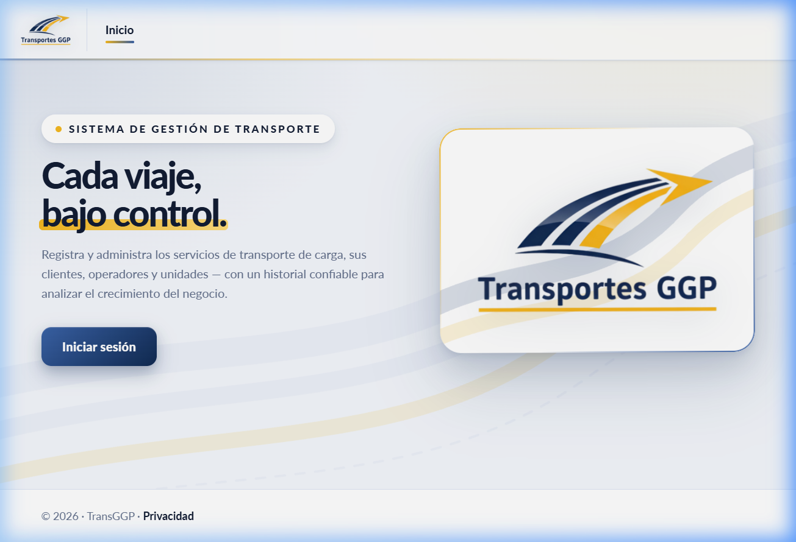 | 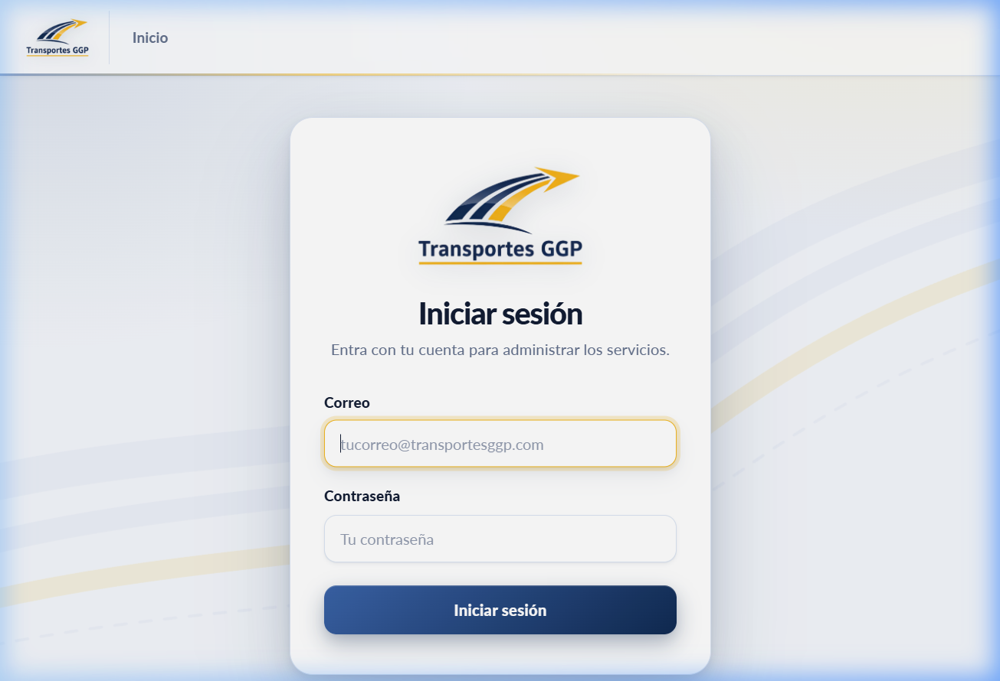 |

| Panel (Dashboard) |
|:-:|
| 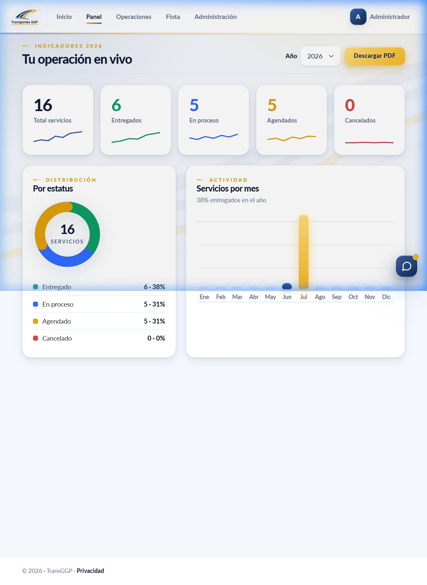 |

| Servicios de transporte | Asistente de análisis (Transpi) |
|:-:|:-:|
| 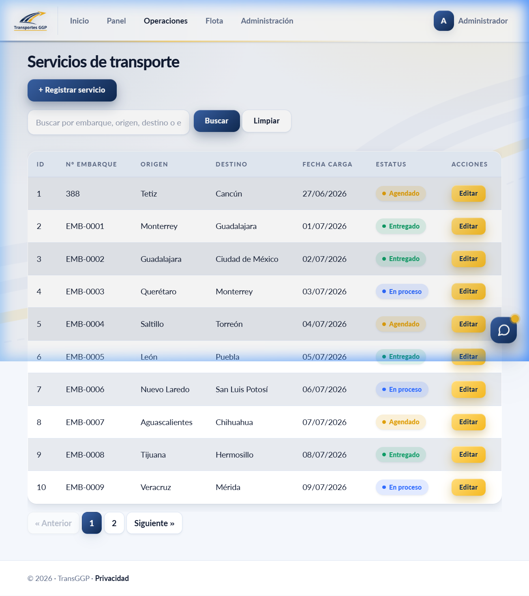 | 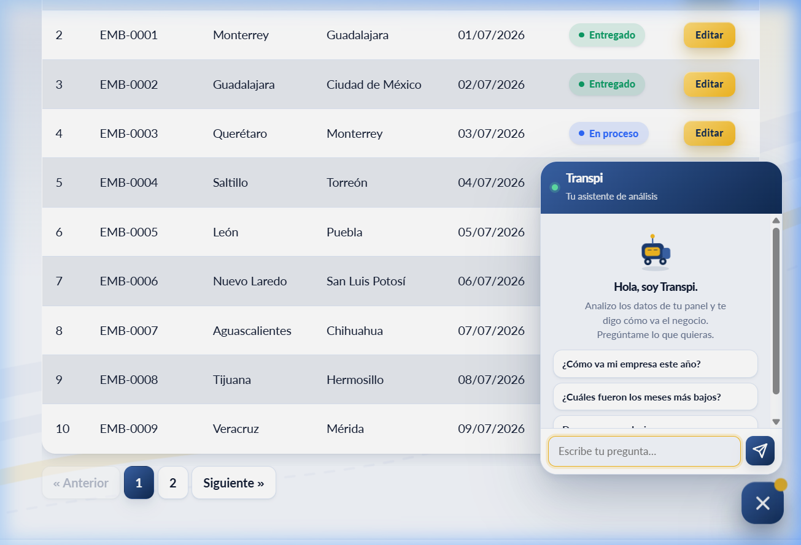 |

</div>

## ── 💻 Tecnologías

- ASP.NET Core 10
- Entity Framework Core (Pomelo)
- MySQL → AWS RDS
- AWS Elastic Beanstalk
- Cloudflare (DNS y proxy HTTPS)
- Swagger / OpenAPI
- xUnit (pruebas unitarias)
- GitHub Actions (CI/CD)
- BCrypt (hashing de contraseñas)

## ── 📁 Estructura del proyecto

```text
Proyecto-ArquitecturaSW/
├── TransGGP/                                    # 🌐 Aplicación Web MVC
│   ├── Controllers/
│   │   ├── HomeController.cs
│   │   ├── ClientesController.cs
│   │   ├── OperadoresController.cs
│   │   ├── UnidadesController.cs
│   │   ├── ServiciosController.cs
│   │   ├── DashboardController.cs
│   │   ├── ConfiguracionesController.cs
│   │   ├── DollysController.cs
│   │   ├── SemirremolquesController.cs
│   │   ├── UsuariosController.cs
│   │   ├── CuentaController.cs
│   │   ├── PerfilController.cs
│   │   └── AsistenteController.cs
│   ├── Views/
│   │   ├── Home/
│   │   ├── Clientes/
│   │   ├── Operadores/
│   │   ├── Servicios/
│   │   ├── Unidades/
│   │   ├── Dashboard/
│   │   ├── Configuraciones/
│   │   ├── Dollys/
│   │   ├── Semirremolques/
│   │   ├── Usuarios/
│   │   ├── Cuenta/
│   │   ├── Perfil/
│   │   ├── Shared/
│   │   ├── _ViewImports.cshtml
│   │   └── _ViewStart.cshtml
│   ├── ViewModels/
│   │   ├── ErrorViewModel.cs
│   │   ├── LoginViewModel.cs
│   │   ├── CambiarPasswordViewModel.cs
│   │   ├── UsuarioCrearViewModel.cs
│   │   └── UsuarioPermisosViewModel.cs
│   ├── wwwroot/                                 # Archivos estáticos (CSS, JS, imágenes)
│   ├── Program.cs
│   ├── TransGGP.Web.csproj
│   └── TransGGP.slnx                           # Archivo de solución
│
├── TransGGP.API/                                # 🔌 API REST
│   ├── Controllers/
│   │   ├── ClientesAPI.cs
│   │   ├── OperadoresAPI.cs
│   │   ├── UnidadesAPI.cs
│   │   ├── ServiciosAPI.cs
│   │   ├── UsuariosAPI.cs
│   │   └── AuthAPI.cs
│   ├── Program.cs
│   ├── TransGGP.API.csproj
│   └── appsettings.json.example
│
├── TransGGP.Application/                        # ⚙️ Capa de Aplicación (Lógica de negocio)
│   ├── Interfaces/                              # Puertos (contratos)
│   │   ├── IClienteRepository.cs
│   │   ├── IOperadorRepository.cs
│   │   ├── IUnidadRepository.cs
│   │   ├── IServicioRepository.cs
│   │   ├── IUsuarioRepository.cs
│   │   ├── IConfiguracionRepository.cs
│   │   ├── IDollyRepository.cs
│   │   ├── ISemirremolqueRepository.cs
│   │   ├── IPasswordHasher.cs
│   │   ├── IReporteCreator.cs
│   │   └── IAsistenteAnalisis.cs
│   ├── Services/
│   │   ├── ClienteService.cs
│   │   ├── OperadorService.cs
│   │   ├── UnidadService.cs
│   │   ├── ServicioService.cs
│   │   ├── UsuarioService.cs
│   │   ├── ConfiguracionService.cs
│   │   ├── DollyService.cs
│   │   ├── SemirremolqueService.cs
│   │   ├── DashboardService.cs
│   │   └── AsistenteService.cs
│   ├── Reports/                                 # Patrón Factory Method
│   │   └── ReporteCreator.cs                    # Creator abstracto + Creators concretos
│   ├── Security/
│   │   ├── Permisos.cs
│   │   └── PermisosUsuario.cs
│   ├── Dashboards/
│   │   └── DashboardModels.cs
│   ├── Exceptions/
│   │   └── ValidacionException.cs
│   └── TransGGP.Application.csproj
│
├── TransGGP.Domain/                             # 🏛️ Capa de Dominio (Entidades)
│   ├── Models/
│   │   ├── Cliente.cs
│   │   ├── Configuracion.cs
│   │   ├── Dolly.cs
│   │   ├── Operador.cs
│   │   ├── Semirremolque.cs
│   │   ├── Servicio.cs
│   │   ├── Unidad.cs
│   │   └── Usuario.cs
│   └── TransGGP.Domain.csproj
│
├── TransGGP.Infrastructure/                     # 🗄️ Capa de Infraestructura (Adaptadores)
│   ├── Data/
│   │   └── ApplicationDbContext.cs              # DbContext de EF Core
│   ├── Repositories/
│   │   ├── ClienteRepository.cs
│   │   ├── OperadorRepository.cs
│   │   ├── UnidadRepository.cs
│   │   ├── ServicioRepository.cs
│   │   ├── UsuarioRepository.cs
│   │   ├── ConfiguracionRepository.cs
│   │   ├── DollyRepository.cs
│   │   └── SemirremolqueRepository.cs
│   ├── Decorators/
│   │   └── ClienteRepositoryLoggingDecorator.cs # Patrón Decorator (logging)
│   ├── Security/
│   │   └── BCryptPasswordHasher.cs
│   ├── Services/
│   │   └── AsistenteAnalisisClaude.cs
│   ├── Migrations/                              # Migraciones de EF Core
│   ├── DependencyInjection.cs                   # Registro de servicios
│   └── TransGGP.Infrastructure.csproj
│
├── TransGGP.xUnit/                              # 🧪 Pruebas unitarias
│   ├── Services/
│   │   ├── ClienteServiceTest.cs
│   │   ├── OperadorServiceTest.cs
│   │   └── UnidadServiceTest.cs
│   ├── Fakes/
│   │   ├── FakeClienteRepository.cs
│   │   ├── FakeOperadorRepository.cs
│   │   └── FakeUnidadRepository.cs
│   └── TransGGP.xUnit.csproj
│
├── docs/                                        # 📖 Documentación
│   ├── ADR-01-Michelle-Camara.md                # Arquitectura seleccionada (MVC)
│   ├── ADR-02-Michelle-Camara.md                # Vistas arquitectónicas y diagramas
│   ├── ADR-03-Michelle-Camara.md                # Incorporación de API REST
│   ├── ADR-04-Michelle-Camara.md                # Migración a Arquitectura Hexagonal
│   ├── ADR-05-Michelle-Camara.md                # Patrones de diseño GoF
│   ├── ADR-06-Michelle-Camara.md                # Deuda técnica y pruebas unitarias
│   ├── ADR-07-Michelle-Camara.md                # Migración a AWS (RDS + Elastic Beanstalk)
│   └── Diagramas.md                             # Diagramas C4 en Mermaid
│
├── images/                                      # 🖼️ Imágenes de documentación
│   ├── logo2.png
│   ├── API.png
│   ├── ArqHexagonal.png
│   ├── DiagaramArquitectonico.jpg
│   ├── DiagramaARH.png
│   ├── DiagramaProcesos.png
│   ├── GET.png
│   ├── Nivel1.png
│   ├── Nivel2.png
│   ├── POST1.png
│   └── POST2.png
│
├── .github/
│   └── workflows/
│       └── ci.yml                               # Pipeline CI/CD
├── .gitignore
└── README.md
```

## ── ★ Arquitectura Hexagonal

El sistema utiliza una **Arquitectura Hexagonal (Puertos y Adaptadores)** que separa las responsabilidades en capas independientes. La regla fundamental es la **dirección de las dependencias**: los adaptadores dependen del núcleo, nunca al revés.

| Proyecto | Rol | Responsabilidad |
|----------|-----|-----------------|
| `TransGGP.Domain` | Núcleo | Entidades del negocio (sin dependencias externas) |
| `TransGGP.Application` | Núcleo | Casos de uso (Services) + puertos (interfaces) |
| `TransGGP.Infrastructure` | Adaptador de salida | Persistencia con EF Core + MySQL (implementa los puertos) |
| `TransGGP.Web` | Adaptador de entrada | Interfaz MVC con Razor Views + Bootstrap |
| `TransGGP.API` | Adaptador de entrada | API REST documentada con Swagger |

Ejemplo de flujo:

```text
ClientesController → ClienteService → IClienteRepository → ClienteRepository → ApplicationDbContext → MySQL
```

Esto permite que la lógica de negocio sea independiente de la base de datos y del framework web.

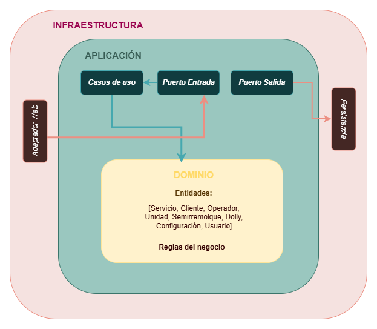

## ── ★ Dominio

Las entidades del dominio están en `TransGGP.Domain/Models` y representan los conceptos del negocio.

Modelos actuales:

- `Cliente`
- `Operador`
- `Unidad`
- `Servicio`
- `Semirremolque`
- `Dolly`
- `Configuracion`
- `Usuario`

## ── ★ Puertos (Interfaces de repositorio)

Las interfaces de repositorio están en `TransGGP.Application/Interfaces` y definen los contratos que la capa de infraestructura debe implementar.

Puertos actuales:

- `IClienteRepository`
- `IOperadorRepository`
- `IUnidadRepository`
- `IServicioRepository`
- `IUsuarioRepository`
- `IConfiguracionRepository`
- `IDollyRepository`
- `ISemirremolqueRepository`
- `IPasswordHasher`
- `IReporteCreator`
- `IAsistenteAnalisis`

Estas interfaces son contratos de dominio. No conocen Entity Framework ni MySQL.

## ── ★ Implementaciones de persistencia

Las implementaciones concretas están en `TransGGP.Infrastructure/Repositories` y usan `ApplicationDbContext` de EF Core.

Implementaciones actuales:

- `ClienteRepository implements IClienteRepository`
- `OperadorRepository implements IOperadorRepository`
- `UnidadRepository implements IUnidadRepository`
- `ServicioRepository implements IServicioRepository`
- `UsuarioRepository implements IUsuarioRepository`
- `ConfiguracionRepository implements IConfiguracionRepository`
- `DollyRepository implements IDollyRepository`
- `SemirremolqueRepository implements ISemirremolqueRepository`

Estas clases conectan la capa de aplicación con Entity Framework Core usando el `ApplicationDbContext`.

## ── 🎨 Patrones de diseño GoF

El proyecto incorpora dos patrones de diseño GoF documentados en el [ADR-05](docs/ADR-05-Michelle-Camara.md):

### Decorator (Estructural)

`ClienteRepositoryLoggingDecorator` envuelve al repositorio real e intercepta cada operación para registrar logs de auditoría sin modificar el código original.

```text
IClienteRepository → ClienteRepositoryLoggingDecorator → ClienteRepository → BD
```

### Factory Method (Creacional)

`ReporteCreator` define el método fábrica para generar reportes en distintos formatos (texto, CSV). Los *creators* concretos (`ReporteTextoCreator`, `ReporteCsvCreator`) deciden qué producto fabricar.

## ── 🌐 API REST

La API REST está en `TransGGP.API/` y expone los recursos del sistema documentados con Swagger.

Controladores API actuales:

- `ClientesAPI`
- `OperadoresAPI`
- `UnidadesAPI`
- `ServiciosAPI`
- `UsuariosAPI`
- `AuthAPI`

### Endpoints principales

**Clientes:**

```text
GET    /api/clientes
POST   /api/clientes
```

Ejemplo para crear un cliente:

```json
{
  "nombre": "Construcciones Verticales de Acero"
}
```

Respuesta (201 Created):

```json
{
  "id": 1,
  "nombre": "Construcciones Verticales de Acero",
  "fechaCreacion": "2026-06-20T10:30:45.1234567"
}
```

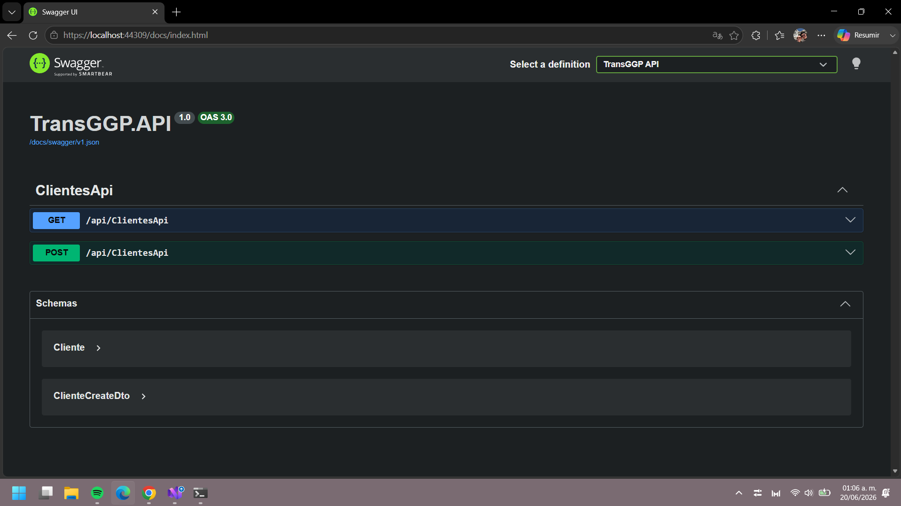
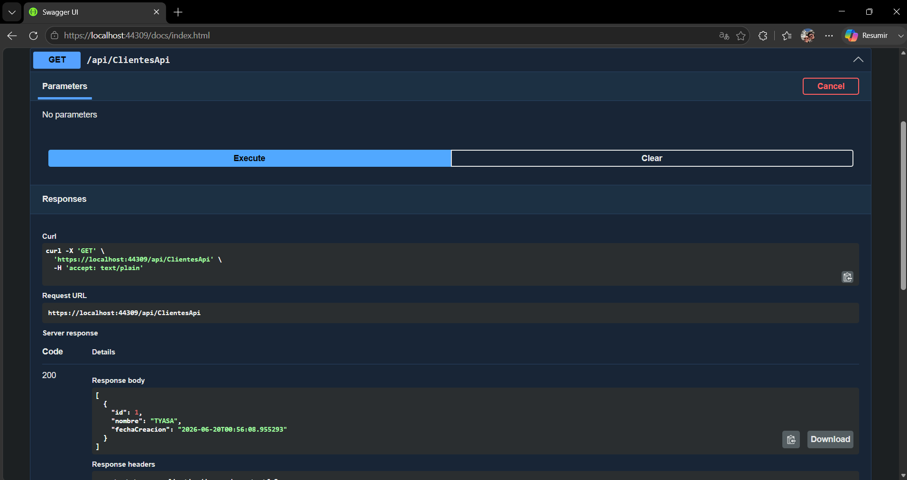
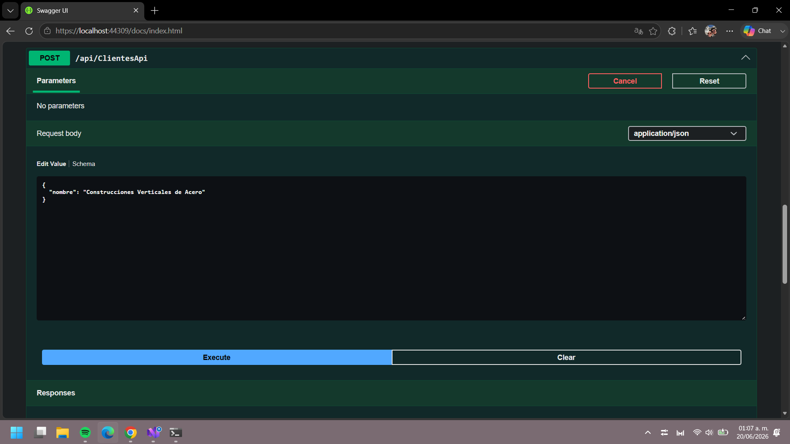
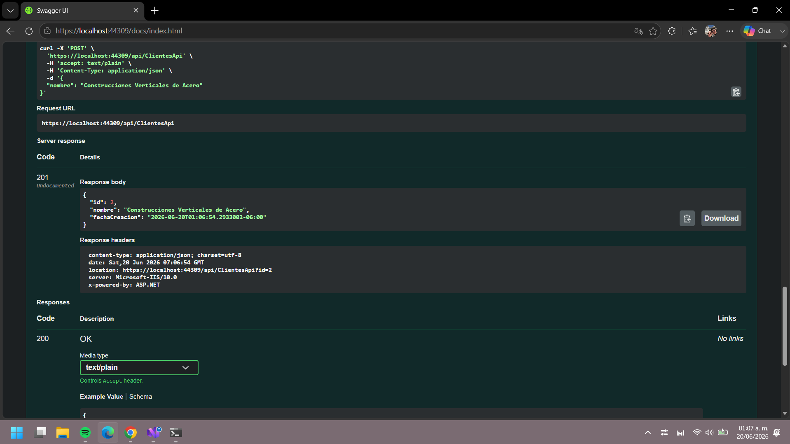

## ── 🧪 Pruebas unitarias

El proyecto incluye una suite de **9 pruebas unitarias** con xUnit que verifican la capa de aplicación sin depender de la base de datos.

Clases probadas:

- `ClienteService` (3 pruebas)
- `OperadorService` (3 pruebas)
- `UnidadService` (3 pruebas)

Cada prueba utiliza la estructura **Arrange-Act-Assert** con repositorios falsos (`FakeClienteRepository`, `FakeOperadorRepository`, `FakeUnidadRepository`) para aislar la lógica de negocio.

Para correr las pruebas:

```powershell
dotnet test TransGGP/TransGGP.slnx --configuration Release
```

## ── ⚡ CI/CD con GitHub Actions

El pipeline de integración continua y despliegue continuo se configura en `.github/workflows/ci.yml` y consta de dos etapas:

### Etapa 1 — Pruebas unitarias

Se ejecuta en cada `push` y en cada Pull Request:

1. Descarga el repositorio
2. Configura el SDK de .NET 10
3. Restaura las dependencias
4. Compila la solución
5. Ejecuta todas las pruebas unitarias

### Etapa 2 — Deploy a AWS

Solo se ejecuta si las pruebas pasaron y no es un Pull Request:

1. Publica la aplicación autocontenida para Linux
2. Empaqueta con `Procfile` para Elastic Beanstalk
3. Sube el paquete a S3
4. Registra la nueva versión en Elastic Beanstalk
5. Actualiza el entorno de producción

## ── ☁️ Infraestructura en AWS

El sistema se despliega en AWS con la siguiente arquitectura:

| Servicio | Uso |
|----------|-----|
| **AWS Elastic Beanstalk** | Hosting de la aplicación .NET (Linux) |
| **AWS RDS (MySQL)** | Base de datos administrada |
| **AWS S3** | Almacenamiento de paquetes de despliegue |
| **Cloudflare** | DNS, proxy HTTPS, protección DDoS |

> Ver [ADR-07](docs/ADR-07-Michelle-Camara.md) para los detalles de la migración de WampServer a RDS y de EC2 a Elastic Beanstalk.

## ── 📊 Diagramas C4

El sistema está documentado con diagramas C4 en Mermaid. Ver la documentación completa en [Diagramas.md](docs/Diagramas.md).

### Nivel 1 — Contexto

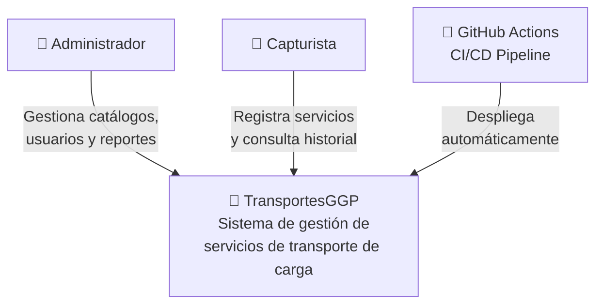

### Nivel 2 — Contenedores

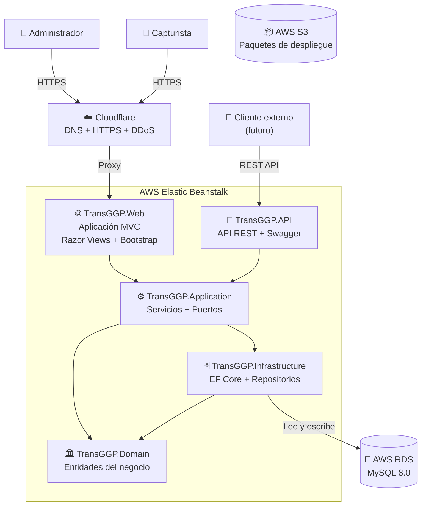

### Nivel 3 — Componentes

```mermaid
graph TB
    subgraph Web["TransGGP.Web — Controladores MVC"]
        CC[ClientesController]
        OC[OperadoresController]
        UC[UnidadesController]
        SC[ServiciosController]
        DC[DashboardController]
        DolC[DollysController]
        SemC[SemirremolquesController]
        ConfC[ConfiguracionesController]
        UsrC[UsuariosController]
        CuC[CuentaController]
    end

    subgraph API["TransGGP.API — Controladores REST"]
        ClientesAPI[ClientesAPI]
        OperadoresAPI[OperadoresAPI]
        UnidadesAPI[UnidadesAPI]
        ServiciosAPI[ServiciosAPI]
        UsuariosAPI[UsuariosAPI]
        AuthAPI[AuthAPI]
    end

    subgraph Application["TransGGP.Application — Servicios y Puertos"]
        SvcCliente[ClienteService]
        SvcOperador[OperadorService]
        SvcUnidad[UnidadService]
        SvcServicio[ServicioService]
        SvcUsuario[UsuarioService]
        SvcDashboard[DashboardService]
        SvcConfig[ConfiguracionService]
        SvcDolly[DollyService]
        SvcSemi[SemirremolqueService]
        SvcAsist[AsistenteService]
        Factory["ReporteCreator\n(Factory Method)"]
        Puertos["Puertos: IClienteRepository\nIOperadorRepository\nIUnidadRepository\nIServicioRepository\nIUsuarioRepository ..."]
    end

    subgraph Infrastructure["TransGGP.Infrastructure — Adaptadores"]
        Decorator["ClienteRepositoryLogging\nDecorator (Decorator Pattern)"]
        RepoCliente[ClienteRepository]
        RepoOper[OperadorRepository]
        RepoUnidad[UnidadRepository]
        RepoServ[ServicioRepository]
        RepoUsr[UsuarioRepository]
        RepoConfig[ConfiguracionRepository]
        RepoDolly[DollyRepository]
        RepoSemi[SemirremolqueRepository]
        DbCtx[ApplicationDbContext]
        BCrypt[BCryptPasswordHasher]
    end

    RDS[("AWS RDS — MySQL")]

    CC --> SvcCliente
    OC --> SvcOperador
    UC --> SvcUnidad
    SC --> SvcServicio
    DC --> SvcDashboard
    UsrC --> SvcUsuario
    ConfC --> SvcConfig
    DolC --> SvcDolly
    SemC --> SvcSemi
    CC --> Factory

    ClientesAPI --> SvcCliente
    OperadoresAPI --> SvcOperador
    UnidadesAPI --> SvcUnidad
    ServiciosAPI --> SvcServicio
    UsuariosAPI --> SvcUsuario
    AuthAPI --> SvcUsuario

    SvcCliente --> Puertos
    SvcOperador --> Puertos
    SvcUnidad --> Puertos
    SvcServicio --> Puertos
    SvcUsuario --> Puertos

    Puertos -.->|Logging| Decorator
    Decorator --> RepoCliente
    Puertos -.-> RepoOper
    Puertos -.-> RepoUnidad
    Puertos -.-> RepoServ
    Puertos -.-> RepoUsr
    Puertos -.-> RepoConfig
    Puertos -.-> RepoDolly
    Puertos -.-> RepoSemi

    RepoCliente --> DbCtx
    RepoOper --> DbCtx
    RepoUnidad --> DbCtx
    RepoServ --> DbCtx
    RepoUsr --> DbCtx
    RepoConfig --> DbCtx
    RepoDolly --> DbCtx
    RepoSemi --> DbCtx
    DbCtx -->|EF Core| RDS
```

## ── 📐 Vistas arquitectónicas

### Vista Lógica

Muestra los módulos funcionales del sistema y sus responsabilidades.

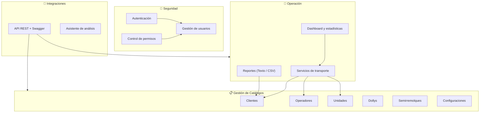

### Vista de Despliegue

Muestra la infraestructura cloud donde vive el sistema.

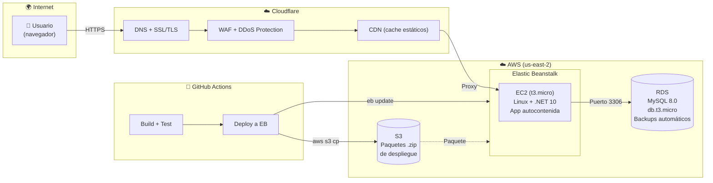

### Vista de Procesos

Muestra el flujo en tiempo de ejecución para el registro de un nuevo servicio.

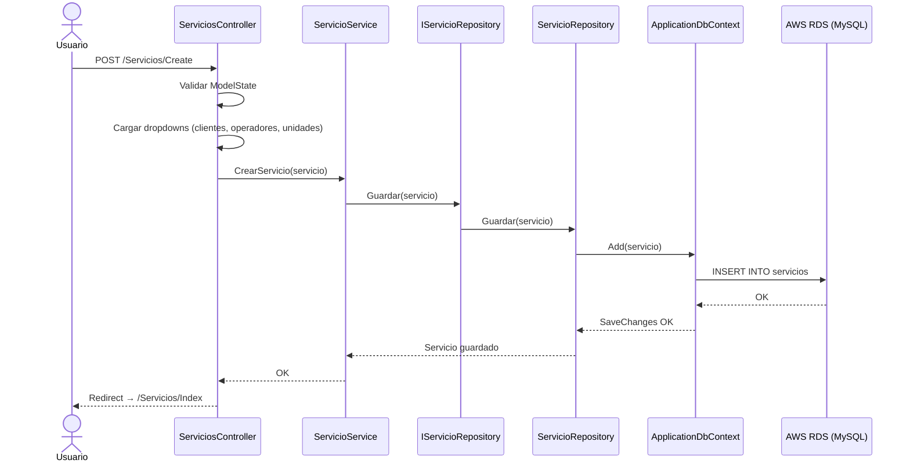

### Arquitectura Hexagonal

Muestra la separación en puertos y adaptadores del sistema.

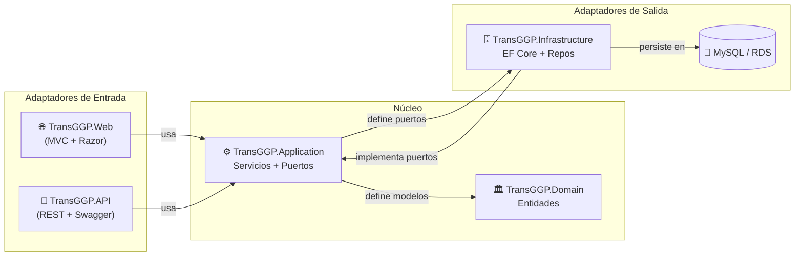

## ── 📖 ADRs (Architecture Decision Records)

| ADR | Título | Estado |
|-----|--------|--------|
| [ADR-01](docs/ADR-01-Michelle-Camara.md) | Arquitectura seleccionada (MVC) | `Descartado` |
| [ADR-02](docs/ADR-02-Michelle-Camara.md) | Vistas arquitectónicas y diagramas | `Propuesto` |
| [ADR-03](docs/ADR-03-Michelle-Camara.md) | Incorporación de API REST | `Propuesto` |
| [ADR-04](docs/ADR-04-Michelle-Camara.md) | Migración a Arquitectura Hexagonal | `Aceptado` |
| [ADR-05](docs/ADR-05-Michelle-Camara.md) | Patrones de diseño GoF (Decorator y Factory Method) | `Propuesto` |
| [ADR-06](docs/ADR-06-Michelle-Camara.md) | Deuda técnica y pruebas unitarias | `Propuesto` |
| [ADR-07](docs/ADR-07-Michelle-Camara.md) | Migración a AWS (RDS + Elastic Beanstalk) | `Aceptado` |

## ── 📖 Swagger

El proyecto incluye Swagger/OpenAPI para documentar y probar la API.

Para ejecutar la aplicación localmente:

```powershell
dotnet run --project TransGGP/TransGGP.Web.csproj
```

Para la API:

```powershell
dotnet run --project TransGGP.API/TransGGP.API.csproj
```

Swagger UI estará disponible en la URL configurada del proyecto API.

## ── 🔨 Compilación

Para compilar el proyecto:

```powershell
dotnet build TransGGP/TransGGP.slnx --configuration Release
```

Para correr las pruebas:

```powershell
dotnet test TransGGP/TransGGP.slnx --configuration Release
```

## ── 🚀 Despliegue

El despliegue a producción es automático mediante GitHub Actions. Al hacer push a la rama principal:

1. Se compila y ejecutan las pruebas
2. Si las pruebas pasan, se publica la aplicación autocontenida para Linux
3. Se empaqueta y sube a S3
4. Se registra la nueva versión en Elastic Beanstalk
5. Se actualiza el entorno de producción

La aplicación está disponible en:

```text
https://www.transportesggp.com
```
