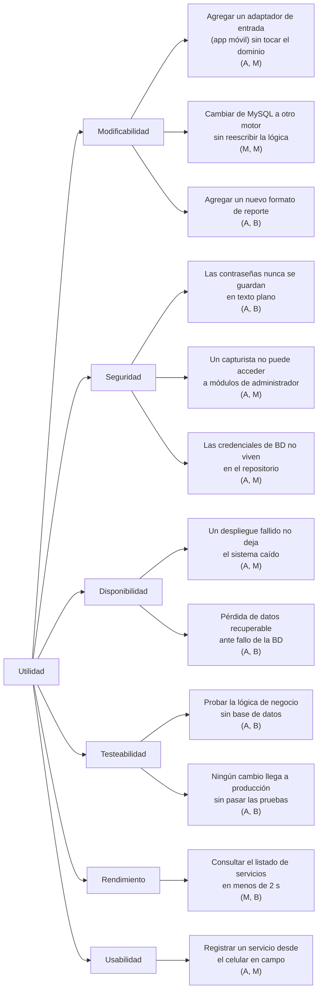

# ATAM: Evaluación de la arquitectura de TransGGP

| Campo  | Valor |
|--------|-------|
| Autor  | Michelle Cámara |
| Fecha  | 31/07/2026 |
| Método | Architecture Tradeoff Analysis Method (SEI) |
| Estado | `Propuesto` |

---

## Contexto

El **ATAM** es un método de evaluación de arquitecturas creado por el SEI (*Software Engineering Institute*) que sirve para revisar si las decisiones arquitectónicas tomadas realmente cumplen con los **atributos de calidad** que el negocio necesita, y para hacer explícitos los **trade-offs** (lo que se gana y lo que se sacrifica con cada decisión).

**TransGGP** es un sistema web de gestión de servicios de transporte de carga para un emprendimiento familiar que opera un tráiler. Esta evaluación analiza la arquitectura definida a lo largo de los [ADR-01](./ADR-01-Michelle-Camara.md) al [ADR-07](./ADR-07-Michelle-Camara.md): Arquitectura Hexagonal, API REST, patrones GoF, pruebas unitarias, CI/CD y despliegue en AWS.

---

## 1. Drivers de negocio y restricciones

| Tipo | Descripción |
|------|-------------|
| **Objetivo de negocio** | Reemplazar las hojas de Excel por un sistema web accesible desde cualquier dispositivo |
| **Objetivo de negocio** | Permitir que el negocio crezca (más unidades, futura app móvil) sin reescribir el sistema |
| **Restricción** | Presupuesto limitado (emprendimiento familiar, ~$25 USD/mes de infraestructura) |
| **Restricción** | Una sola desarrolladora, principiante, con tres meses de desarrollo |
| **Restricción** | Stack ya definido: .NET 10 + Entity Framework Core + MySQL |
| **Restricción** | Volumen bajo de operación (un tráiler, pocos usuarios concurrentes) |

---

## 2. Árbol de utilidad (*Utility Tree*)

Cada escenario se califica como `(Importancia para el negocio, Dificultad técnica)` en escala **A** = alta, **M** = media, **B** = baja.

---

## 3. Escenarios de calidad priorizados

| # | Atributo | Estímulo | Respuesta esperada | Medida | Prioridad |
|---|----------|----------|--------------------|--------|:---------:|
| E1 | Modificabilidad | Se decide construir una app móvil que consuma el sistema | Se agrega un adaptador de entrada nuevo reutilizando los mismos `Services` de `TransGGP.Application` | 0 cambios en `Domain` y `Application` | `(A, M)` |
| E2 | Modificabilidad | Se necesita exportar reportes en un formato nuevo | Se agrega un *creator* concreto de `ReporteCreator` (Factory Method) | 1 clase nueva, sin modificar las existentes | `(A, B)` |
| E3 | Seguridad | Un atacante obtiene un volcado de la tabla `usuarios` | Las contraseñas están hasheadas con BCrypt y no son reversibles | 0 contraseñas en texto plano | `(A, B)` |
| E4 | Seguridad | Un usuario capturista intenta entrar a `/Usuarios` | El sistema bloquea el acceso según `PermisosUsuario` | 0 accesos no autorizados | `(A, M)` |
| E5 | Disponibilidad | Un despliegue introduce un error en producción | Elastic Beanstalk permite volver a la versión anterior | Rollback a la versión previa desde la consola de EB | `(A, M)` |
| E6 | Disponibilidad | La base de datos falla o se corrompe | RDS restaura desde un snapshot automático | Retención de respaldos: 7 días | `(A, B)` |
| E7 | Testeabilidad | Se modifica una regla de negocio de `ClienteService` | Las pruebas con repositorios *fake* detectan la regresión sin levantar MySQL | 9 pruebas xUnit, 0 dependencias de BD | `(A, B)` |
| E8 | Testeabilidad | Se hace *push* con un cambio que rompe la compilación o una prueba | El pipeline falla y no despliega a producción | 0 despliegues con pruebas en rojo | `(A, B)` |
| E9 | Rendimiento | Un usuario abre el listado de servicios | La página responde en tiempo aceptable para uso operativo | Objetivo: < 2 s en t3.micro | `(M, B)` |
| E10 | Usabilidad | El operador registra un servicio desde el celular | La interfaz responsiva permite completar el registro sin zoom | Vistas Razor + Bootstrap responsivo | `(A, M)` |

---

## 4. Decisiones arquitectónicas evaluadas

| Decisión | ADR | Atributos que favorece | Atributos que perjudica |
|----------|-----|------------------------|-------------------------|
| Arquitectura Hexagonal (puertos y adaptadores) | [ADR-04](./ADR-04-Michelle-Camara.md) | Modificabilidad, Testeabilidad, Portabilidad | Simplicidad, curva de aprendizaje |
| API REST separada de la web MVC | [ADR-03](./ADR-03-Michelle-Camara.md) | Interoperabilidad, Modificabilidad | Costo de mantener dos adaptadores |
| Patrón Decorator para logging | [ADR-05](./ADR-05-Michelle-Camara.md) | Auditabilidad, Modificabilidad | Rendimiento (E/S extra), trazabilidad del flujo |
| Patrón Factory Method para reportes | [ADR-05](./ADR-05-Michelle-Camara.md) | Extensibilidad | Más clases para un caso simple |
| Pruebas unitarias con *fakes* (xUnit) | [ADR-06](./ADR-06-Michelle-Camara.md) | Testeabilidad, Confiabilidad | Tiempo de desarrollo |
| CI/CD con GitHub Actions | [ADR-06](./ADR-06-Michelle-Camara.md) | Disponibilidad, Confiabilidad | Dependencia de secretos y de un servicio externo |
| AWS RDS administrado | [ADR-07](./ADR-07-Michelle-Camara.md) | Disponibilidad, Seguridad, Mantenibilidad | Costo mensual, latencia frente a BD local |
| AWS Elastic Beanstalk | [ADR-07](./ADR-07-Michelle-Camara.md) | Disponibilidad, Automatización del despliegue | Observabilidad de bajo nivel del servidor |
| Cloudflare como proxy HTTPS | [ADR-07](./ADR-07-Michelle-Camara.md) | Seguridad, Rendimiento (CDN) | Dependencia de un tercero en la ruta crítica |

---

## 5. Puntos de sensibilidad y trade-offs

### Puntos de sensibilidad

Decisiones donde un cambio afecta fuertemente a un atributo de calidad:

| # | Punto de sensibilidad | Atributo afectado |
|---|-----------------------|-------------------|
| PS1 | La **dirección de las dependencias** (que `Application` defina los puertos y `Infrastructure` los implemente) es lo que sostiene toda la modificabilidad y testeabilidad. Si un `Service` importara EF Core directamente, el beneficio desaparece. | Modificabilidad, Testeabilidad |
| PS2 | El **factor de trabajo (*work factor*) de BCrypt** determina qué tan costoso es un ataque de fuerza bruta, pero también el tiempo de cada inicio de sesión. | Seguridad ↔ Rendimiento |
| PS3 | El **tipo de instancia** (`t3.micro` en EB y `db.t3.micro` en RDS) define directamente el tiempo de respuesta bajo carga. | Rendimiento ↔ Costo |
| PS4 | La **cobertura de pruebas** (hoy 9 pruebas sobre 3 servicios) determina cuánto protege realmente el pipeline antes de desplegar. | Confiabilidad |

### Trade-offs

Puntos donde una decisión mejora un atributo a costa de otro:

| # | Trade-off | Resolución adoptada |
|---|-----------|---------------------|
| T1 | **Modificabilidad vs. Simplicidad**: la Arquitectura Hexagonal agrega 5 proyectos e interfaces frente a un MVC monolítico. | Se acepta la complejidad: sin ella, web y API duplicarían la lógica ([ADR-04](./ADR-04-Michelle-Camara.md)). |
| T2 | **Auditabilidad vs. Rendimiento**: el Decorator de logging escribe un registro por cada operación de cliente. | Se acepta: el volumen de operaciones es bajo y la trazabilidad tiene más valor. |
| T3 | **Disponibilidad vs. Costo**: RDS Multi-AZ daría alta disponibilidad real, pero duplica el costo. | Se queda en instancia única con respaldos automáticos; Multi-AZ queda para cuando el negocio lo justifique. |
| T4 | **Automatización vs. Control**: Elastic Beanstalk simplifica el despliegue pero oculta la configuración del servidor. | Se acepta: la carga operativa importa más que el control fino, con SSH disponible como salida de emergencia. |
| T5 | **Seguridad vs. Facilidad de operación**: las credenciales viven en variables de entorno de EB y en *secrets* de GitHub, no en el repositorio. | Se acepta la solución actual; migrar a OIDC con IAM Roles queda como mejora pendiente ([ADR-07](./ADR-07-Michelle-Camara.md)). |

---

## 6. Riesgos y no-riesgos

### Riesgos identificados

| # | Riesgo | Escenario afectado | Mitigación propuesta |
|---|--------|--------------------|----------------------|
| R1 | El *tight coupling* en `Program.cs` y los controladores acoplados a clases concretas erosionan la modificabilidad que promete la arquitectura hexagonal ([ADR-06](./ADR-06-Michelle-Camara.md), deuda #1). | E1, E7 | Registrar por interfaces (`IClienteService`) y mover el *wiring* del decorador a una extensión de infraestructura. |
| R2 | `ServiciosController` concentra validación, carga de catálogos y lógica de negocio (*god class*, deuda #2). | E1, E7, E10 | Extraer la lógica a `ServicioService` y a un ViewModel dedicado. |
| R3 | La cobertura de pruebas cubre solo 3 de los 10 servicios; `ServicioService`, `UsuarioService` y `DashboardService` no tienen pruebas. | E7, E8 | Ampliar la suite xUnit a los servicios restantes con sus respectivos *fakes*. |
| R4 | Las credenciales de AWS son claves de larga duración guardadas como *secrets* de GitHub Actions. | E3 | Migrar a OIDC con IAM Roles y rotar las claves actuales. |
| R5 | Instancia única de RDS y de EB: un fallo de zona de disponibilidad deja el sistema caído hasta restaurar. | E5, E6 | Documentar el procedimiento de restauración; evaluar Multi-AZ cuando el presupuesto lo permita. |
| R6 | La dependencia del asistente de análisis (`AsistenteAnalisisClaude`) introduce un servicio externo en un flujo de la aplicación. | E9 | Aislado tras el puerto `IAsistenteAnalisis`; conviene degradar con elegancia si el servicio no responde. |

### No-riesgos

Decisiones evaluadas y consideradas sólidas:

- **NR1** — El hasheo de contraseñas con BCrypt detrás del puerto `IPasswordHasher` cubre el escenario E3 y permite cambiar de algoritmo sin tocar la lógica de negocio.
- **NR2** — El pipeline de CI/CD bloquea el despliegue si fallan las pruebas o la compilación, cubriendo el escenario E8.
- **NR3** — Los respaldos automáticos de RDS con 7 días de retención cubren el escenario E6.
- **NR4** — El Factory Method de reportes cubre el escenario E2 sin modificar código existente (principio abierto/cerrado).
- **NR5** — Para el volumen real de operación (un tráiler, pocos usuarios concurrentes), las instancias `t3.micro` son suficientes: el rendimiento no es un atributo crítico hoy.

---

## 7. Conclusión de la evaluación

La arquitectura **cumple bien con los atributos de calidad prioritarios del negocio**: la modificabilidad y la testeabilidad quedan garantizadas por la separación en puertos y adaptadores, la seguridad de credenciales por BCrypt y la disponibilidad por los servicios administrados de AWS.

Los riesgos más importantes (**R1**, **R2** y **R3**) no vienen del diseño arquitectónico sino de **deuda técnica en la implementación**: el código todavía no respeta del todo la arquitectura que declara. Pagar esa deuda es lo que más valor aportaría en la siguiente iteración, porque son precisamente los puntos que erosionan la modificabilidad y la testeabilidad —los dos atributos que justificaron migrar a Arquitectura Hexagonal ([ADR-04](./ADR-04-Michelle-Camara.md)).

> **Nota sobre las mediciones**: los valores marcados como *objetivo* (por ejemplo, el tiempo de respuesta del escenario E9) son metas de diseño, no mediciones tomadas en producción. Del mismo modo, un ATAM formal se realiza en un taller con los *stakeholders* del sistema; esta evaluación fue elaborada por la desarrolladora a partir de los ADR ya documentados.

---

## Cláusula de IA

Se utilizó una herramienta de inteligencia artificial como apoyo para redactar y estructurar este documento según las etapas del método ATAM. Los escenarios, riesgos y trade-offs se derivaron de las decisiones ya documentadas en los ADR del proyecto y de la deuda técnica identificada en el ADR-06. La mayoría del proyecto está realizado con las diapositivas del profesor.
