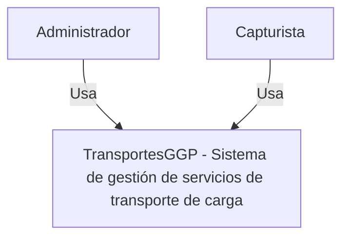
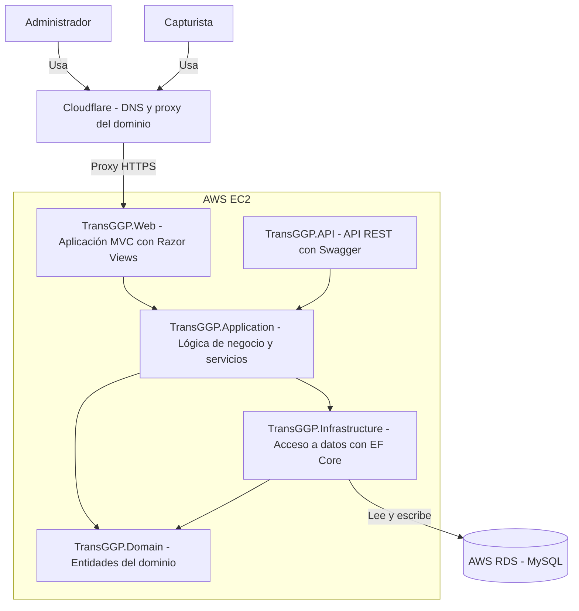
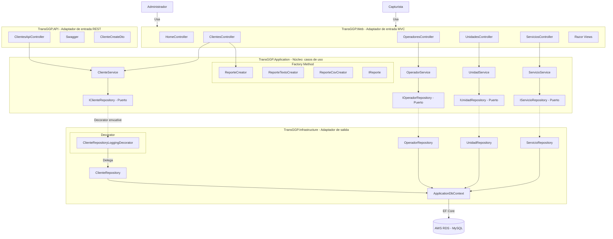

# Arquitectura de Transportes GGP

## Diagrama Modelo C4

El modelo C4 es una forma de representar la arquitectura de un sistema de software. En donde, el primer nivel es el contexto del sistema, quién lo usa y qué es. El siguiente nivel, es el contenedor (aplicaciones, bases de datos, etc.), el tercero son los componentes, y el cuarto son el código.

## Nivel 1

En este nivel, se muestra los usuarios Administrador y Capturista, los cuales interactuan con el sistema de gestión de servicios de transporte de carga. 

## Nivel 2

En este nivel, se muestra los contenedores de la arquitectura, es decir, las aplicaciones, bases de datos, etc. En este caso, se muestra el frontend, la api, la base de datos, etc. Y como se comunican entre sí. 

## Nivel 3

En este nivel, se muestra los componentes de la arquitectura, es decir, las aplicaciones, bases de datos, etc. En este caso, se muestra el frontend, la api, la base de datos, etc. Y además, los patrones de diseño que se utilizan en cada componente y como se comunican entre sí para lograr la funcionalidad del sistema.