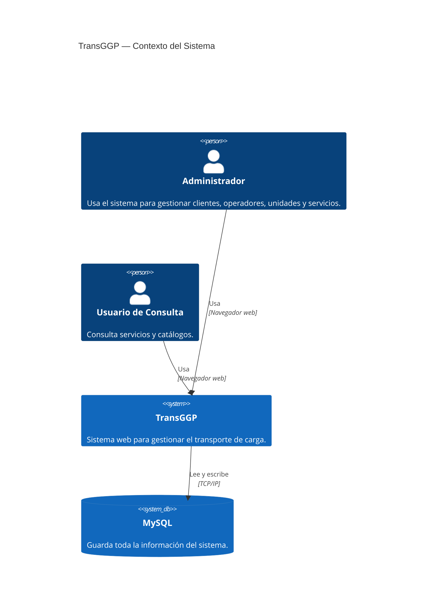

# Arquitectura de Transportes GGP

## Diagrama Modelo C4

El modelo C4 es una forma de representar la arquitectura de un sistema de software. En donde, el primer nivel es el contexto del sistema, quién lo usa y qué es. El siguiente nivel, es el contenedor (aplicaciones, bases de datos, etc.), el tercero son los componentes, y el cuarto son el código.

## Nivel 1

