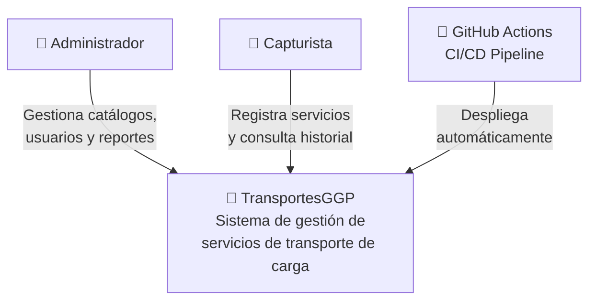
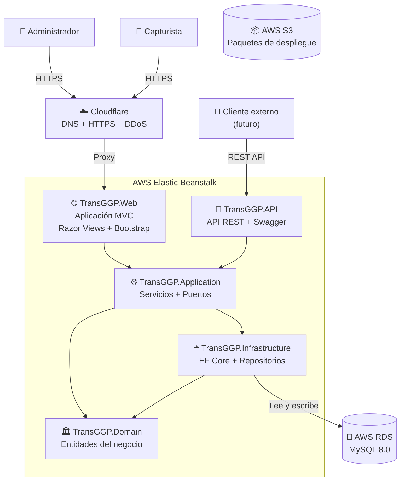

# Arquitectura de Transportes GGP

## Diagrama Modelo C4

El modelo C4 es una forma de representar la arquitectura de un sistema de software. En donde, el primer nivel es el contexto del sistema, quién lo usa y qué es. El siguiente nivel, es el contenedor (aplicaciones, bases de datos, etc.), el tercero son los componentes, y el cuarto son el código.

## Nivel 1

En este nivel, se muestra los usuarios Administrador y Capturista, los cuales interactuan con el sistema de gestión de servicios de transporte de carga. También se muestra GitHub Actions como actor externo que despliega automáticamente la aplicación.

## Nivel 2

En este nivel, se muestra los contenedores de la arquitectura. La aplicación se despliega en **AWS Elastic Beanstalk** (que reemplazó a EC2 directo) con cinco proyectos internos. La base de datos es **AWS RDS MySQL** (que reemplazó a WampServer local). Cloudflare funciona como proxy inverso con DNS, SSL/TLS y protección DDoS. Los paquetes de despliegue se almacenan en S3.

## Nivel 3

```mermaid
graph TB
    subgraph Web["TransGGP.Web — Controladores MVC"]
        CC[ClientesController]
        OC[OperadoresController]
        UC[UnidadesController]
        SC[ServiciosController]
        DC[DashboardController]
        DolC[DollysController]
        SemC[SemirremolquesController]
        ConfC[ConfiguracionesController]
        UsrC[UsuariosController]
        CuC[CuentaController]
    end

    subgraph API["TransGGP.API — Controladores REST"]
        ClientesAPI[ClientesAPI]
        OperadoresAPI[OperadoresAPI]
        UnidadesAPI[UnidadesAPI]
        ServiciosAPI[ServiciosAPI]
        UsuariosAPI[UsuariosAPI]
        AuthAPI[AuthAPI]
    end

    subgraph Application["TransGGP.Application — Servicios y Puertos"]
        SvcCliente[ClienteService]
        SvcOperador[OperadorService]
        SvcUnidad[UnidadService]
        SvcServicio[ServicioService]
        SvcUsuario[UsuarioService]
        SvcDashboard[DashboardService]
        SvcConfig[ConfiguracionService]
        SvcDolly[DollyService]
        SvcSemi[SemirremolqueService]
        SvcAsist[AsistenteService]
        Factory["ReporteCreator\n(Factory Method)"]
        Puertos["Puertos: IClienteRepository\nIOperadorRepository\nIUnidadRepository\nIServicioRepository\nIUsuarioRepository ..."]
    end

    subgraph Infrastructure["TransGGP.Infrastructure — Adaptadores"]
        Decorator["ClienteRepositoryLogging\nDecorator (Decorator Pattern)"]
        RepoCliente[ClienteRepository]
        RepoOper[OperadorRepository]
        RepoUnidad[UnidadRepository]
        RepoServ[ServicioRepository]
        RepoUsr[UsuarioRepository]
        RepoConfig[ConfiguracionRepository]
        RepoDolly[DollyRepository]
        RepoSemi[SemirremolqueRepository]
        DbCtx[ApplicationDbContext]
        BCrypt[BCryptPasswordHasher]
    end

    RDS[("AWS RDS — MySQL")]

    CC --> SvcCliente
    OC --> SvcOperador
    UC --> SvcUnidad
    SC --> SvcServicio
    DC --> SvcDashboard
    UsrC --> SvcUsuario
    ConfC --> SvcConfig
    DolC --> SvcDolly
    SemC --> SvcSemi
    CC --> Factory

    ClientesAPI --> SvcCliente
    OperadoresAPI --> SvcOperador
    UnidadesAPI --> SvcUnidad
    ServiciosAPI --> SvcServicio
    UsuariosAPI --> SvcUsuario
    AuthAPI --> SvcUsuario

    SvcCliente --> Puertos
    SvcOperador --> Puertos
    SvcUnidad --> Puertos
    SvcServicio --> Puertos
    SvcUsuario --> Puertos

    Puertos -.->|Logging| Decorator
    Decorator --> RepoCliente
    Puertos -.-> RepoOper
    Puertos -.-> RepoUnidad
    Puertos -.-> RepoServ
    Puertos -.-> RepoUsr
    Puertos -.-> RepoConfig
    Puertos -.-> RepoDolly
    Puertos -.-> RepoSemi

    RepoCliente --> DbCtx
    RepoOper --> DbCtx
    RepoUnidad --> DbCtx
    RepoServ --> DbCtx
    RepoUsr --> DbCtx
    RepoConfig --> DbCtx
    RepoDolly --> DbCtx
    RepoSemi --> DbCtx
    DbCtx -->|EF Core| RDS
```

En este nivel, se muestra los componentes de la arquitectura con todos los controladores (13 MVC + 6 API), los 10 servicios de aplicación, los puertos (interfaces) y las 8 implementaciones de repositorio. También se muestran los patrones de diseño: **Decorator** en el repositorio de clientes para logging, y **Factory Method** para la generación de reportes.

## Claúsula de IA

En este diagrama, se utilizó Inteligencia Artificial para generar entender la estructura y la sintaxis de mermaid como código. Además que corrigió alguna sintaxis errónea ya escrita.